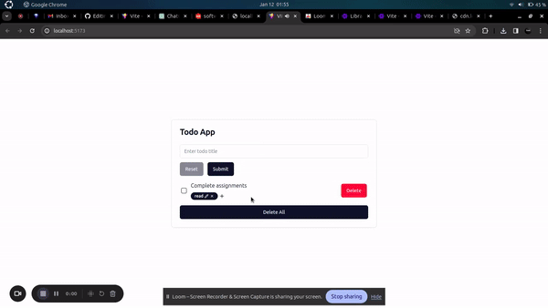

# To-do App
## About
This to-do app allows you to add list items one by one.


## Research tasks
Please refer to the instructions you received via email to access all steps in their entirety.
Today, you'll be asked to do the following:

### Add a new tagging feature to the to-do list app
Add a tagging feature to each to-do list item:
- You should be able to add more than one tag to each item. 
- You should be able to delete tags from list items. 
- You should be able to edit tags after they’ve been made.





### Add test coverage
Add test coverage for 95%+ of the repo

### Complete a post-test survey
Please refer to the instructions you received via email to access your post-test survey


## How to run this project
```
pnpm install
pnpm dev
```
Then visit http://localhost:5173.

## How to test this project
```
pnpm test
```

## Further information
### React + TypeScript + Vite

This template provides a minimal setup to get React working in Vite with HMR and some ESLint rules.

Currently, two official plugins are available:

- [@vitejs/plugin-react](https://github.com/vitejs/vite-plugin-react/blob/main/packages/plugin-react/README.md) uses [Babel](https://babeljs.io/) for Fast Refresh
- [@vitejs/plugin-react-swc](https://github.com/vitejs/vite-plugin-react-swc) uses [SWC](https://swc.rs/) for Fast Refresh

### Expanding the ESLint configuration

If you are developing a production application, we recommend updating the configuration to enable type-aware lint rules:

- Configure the top-level `parserOptions` property like this:

```js
export default {
  // other rules...
  parserOptions: {
    ecmaVersion: 'latest',
    sourceType: 'module',
    project: ['./tsconfig.json', './tsconfig.node.json'],
    tsconfigRootDir: __dirname,
  },
}
```

- Replace `plugin:@typescript-eslint/recommended` to `plugin:@typescript-eslint/recommended-type-checked` or `plugin:@typescript-eslint/strict-type-checked`
- Optionally add `plugin:@typescript-eslint/stylistic-type-checked`
- Install [eslint-plugin-react](https://github.com/jsx-eslint/eslint-plugin-react) and add `plugin:react/recommended` & `plugin:react/jsx-runtime` to the `extends` list
